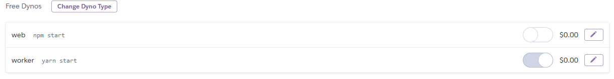

# Stalk Tracker

## Summary

This is a discord bot that will allow a server to track their turnip prices together!

#### Features:

- Price logging for Nook and Daisy
- All-time stats summary
- Today's stats
- DM Notifications for price thresholds

## How to Deploy

Can be deployed on Heroku for free! Click the below button to set up your deployment. You will need to have already created a bot account for it to log into. You can follow a tutorial such as [this one](https://medium.com/davao-js/2019-tutorial-creating-your-first-simple-discord-bot-47fc836a170b) (under the "Generating Token Key" and "Adding bot to our test server" sections) to get that set up.

## Set Up

After deployment with the template, go to 'Manage App'. First, click Configure Dynos, turn OFF the web dyno and turn ON the worker dyno. It should look like the below after turning on:

#### IMPORTANT:

If you are using the heroku deployment template, it will have you do this step during setup. If you do manual deployment, you will need to set up environment secrets for the bot to run correctly. These are called `Config Vars` in Heroku, or just in a .env file locally. Follow the set up instructions below for more info.

You will need to set up:

- `SEND_UPDATES` A boolean flag (`true` or `false`) for whether or not to post updates to the update channel
- `COMMAND_CHANNEL` the ID of the channel to run commands in
- `UPDATE_CHANNEL` the ID of the channel to post updates to
- `TIMEZONE` In standard ISO format such as `America/Denver`
- `TOKEN` The Discord bot token for it to log into.

## Timezones

In order to handle people in different timezones, the bot will read the user's role. Currently the 4 supported roles are for the primary 4 contiguous US timezones, ("Eastern Time", "Central Time", "Mountain Time" and "Pacific Time"). Make sure these roles are set exactly as shown here for the bot to pick them up. I may expand this feature in the future to handle more timezones.

## Architecture

Written in TypeScript, runs in Node.js using the Discord.js library.
